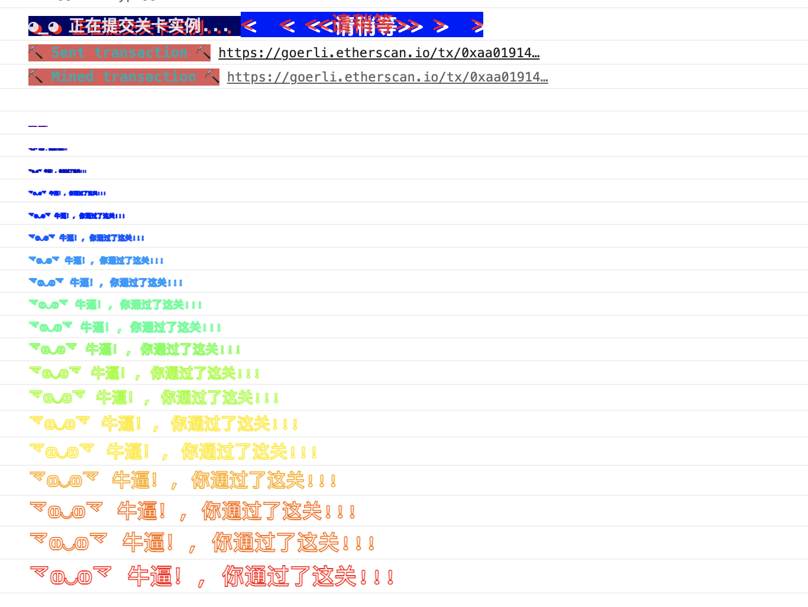

# 执行Level2_Fallout.js
先进入leve2目录
```shell
cd ./level2
node Level2_Fallout.js
```

# 通关条件
* 获得Fallout合约的所有权

# 解题思路

观察合约发现，只有一个方法可以让我们成为合约的owner,那就是构造方法。
```shell
    /* constructor */
    function Fal1out() public payable {
        owner = msg.sender;
        allocations[owner] = msg.value;
    }
```
但是这个方法是在创建合约的时候就调用的呀,ethernaut已经帮我们创建好了。但是不管怎么么样，我们想看
看现在这个合约的owner是谁。

`查看现在合约的owner`
```shell
    //查看合约的owner
    const owner = await contract.owner();
    console.log("owner==" + owner);
```
`输出如下`\

owner==0x0000000000000000000000000000000000000000

WTF?为什么合约的owner是一个黑洞地址？而不是ethernaut的地址,明明在创建合约的时候在构造函数里
面就指定了呀。等等！难道构造函数有问题？我们仔细观察一下，WTF！为什么是`Fal1out`而不是`Fallout`
这里怎么和合约的名字不一样。现在我们恍然大悟，原来是构造函数名字写错了，合约的构造函数还没有被执行
合约还没没创建出来。我们只需要调用一下`Fallout`构造函数，让合约创建出来就可以让合约的owner变成
我们了。

# 解题流程
1. 构造transaction数据
2. 调用Fallout函数
3. 再次查看合约的owner

