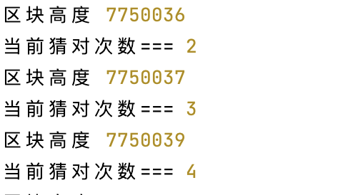

# 执行Level3_CoinFlip
先进入leve3目录
```shell
cd ./level3
node Level3_CoinFlip.js
```

# 通关条件
* 这是一个掷硬币的游戏，你需要连续的猜对结果。完成这一关，你需要通过你的超能力来连续猜对十次

# 解题思路

观察合约发现，这个合约真正执行的只有一个方法。
```shell
    function flip(bool _guess) public returns (bool) {
        uint256 blockValue = uint256(blockhash(block.number.sub(1)));

        if (lastHash == blockValue) {
            revert();
        }

        lastHash = blockValue;
        uint256 coinFlip = blockValue.div(FACTOR);
        bool side = coinFlip == 1 ? true : false;

        if (side == _guess) {
            consecutiveWins++;
            return true;
        } else {
            consecutiveWins = 0;
            return false;
        }
    }
```
输入bool类型是自己的猜想，返回bool类型是验证自己的猜想是否正确。通过`consecutiveWins`查看自己
猜对了几次。\
观察发现这个合约足够简单，并没有逻辑上的错误。查看`solidity`版本并没有类型上错误。那么有切仅有
一种方法了，那就是一直调用`flip()`，直到`consecutiveWins`变成10。虽然连续猜对10的概率很小，但是
并不代表没有。\
我输入`true`认为10次都是`true`。经过一下午的运行，最大纪录为连续4次为`true`\


