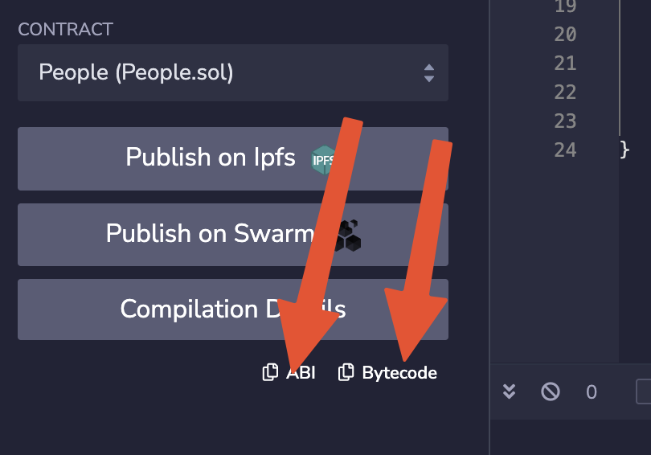
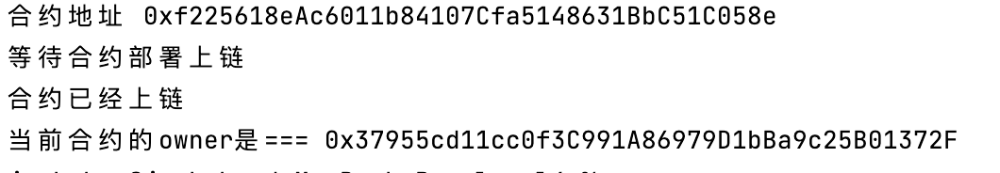
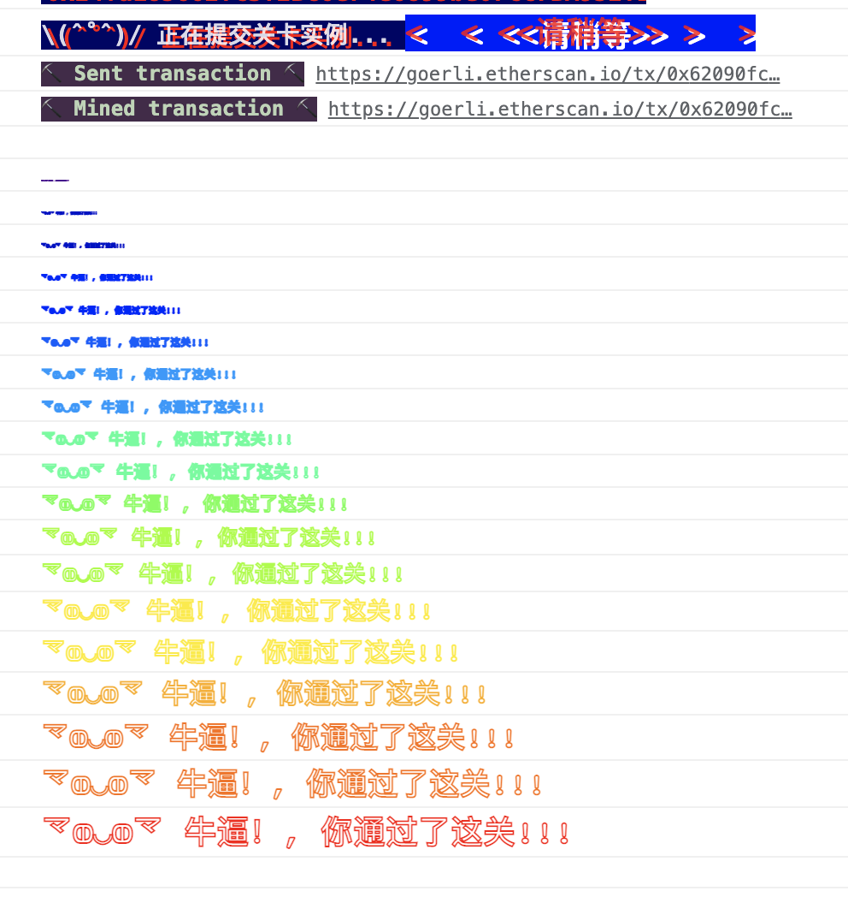

# Telephone.js
先进入leve4目录
```shell
cd ./level4
node Telephone.js
```

# 通关条件

* 让自己变成合约的owner
# 解题思路

这个合约很简单，一个构造函数，一个`changeOwner()`函数。因为合约不是我们创建的，是在`Ethernaut`官网
上点击生成实例，由`Ethernaut`创建的。构造函数是合约创建的时候执行的，有切仅执行一次。所以目标移动
到`changeOwner()`函数。查看`changeOwner()`函数，入参是想赋予的owner地址。这个没有什么可以说的。
所以关键点只能在` if (tx.origin != msg.sender)`这句上。

- tx.origin是什么？\
官方文档说明: `tx.origin` sender of the transaction (full call chain).意思就是交易的
发起者(从透到尾的一次链上调用)。
- msg.sender是什么？\
官方文档说明: `msg.sender` sender of the message (current call).意思就是消息的发送者(当
前调用)
- 如何理解？\
A拿着电话给B打电话。A:`tx.origin`。电话:`msg.sender`

因此满足` if (tx.origin != msg.sender)`条件的方式就是新建一个合约去调用Telephone合约。这样
`tx.origin`是我们的，而`msg.sender`是新建的合约。这里我们新建`People`合约去调用`Telephone`
合约。
```shell
contract Telephone {

    address public owner;

    constructor() public {
        owner = msg.sender;
    }

    function changeOwner(address _owner) public {
        if (tx.origin != msg.sender) {
            owner = _owner;
        }
    }
}

```
## 实践
### 一.使用Remix编译People合约得到bytecode和abicode

注意：bytecode只需要拷贝object字段后面的不需要拷贝整个文本。如果无法使用Remix，我已经把bytecode和abicode
放到了目录下。
### 二.执行Telephone.js,得到如下结果

这个时候合约的owner已经变为你的钱包地址
### 三.去[Ethernaut官网](https://ethernaut.openzeppelin.com/level/0x466BDd41a04473A01031C9D80f61A9487C7ef488)提交实例，得到如下结果

