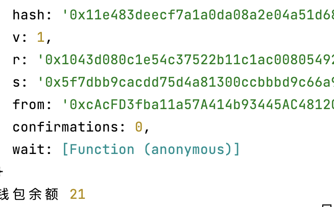

# 通关条件
这一关的目标是攻破下面这个基础 token 合约

你最开始有20个 token, 如果你通过某种方法可以增加你手中的 token 数量,你就可以通过这一关,当然越多
越好.

# 解题思路
* 首先观察solidity版本
```shell
pragma solidity ^0.6.0;
```
solidity在8.0版本解决了数据下溢问题。因为当前版本是6.0版本，所以要特别注意当前版本是存在数据溢出问
题的。

* 查看下面这段函数
```shell
    function transfer(address _to, uint _value) public returns (bool) {
        require(balances[msg.sender] - _value >= 0);
        balances[msg.sender] -= _value;
        balances[_to] += _value;
        return true;
    }
```
这段函数可以执行下去的条件是`msg.sender`的钱包余额必须大于要转账的额度。但是在`6.0`版本中因为
有数据溢出问题。导致`uint256(-1)=2^256-1`也就是说只要差值为-1，那必定是大于0的。

# 解法
假如A的Token额度是20，那么我首先给B转1个额度的Token(A -> B).然后用B给A转2个Token(B -> A),那么
因为`1-2 = -1`所以require的条件就会✅。那么A此时的Token额度为21。

